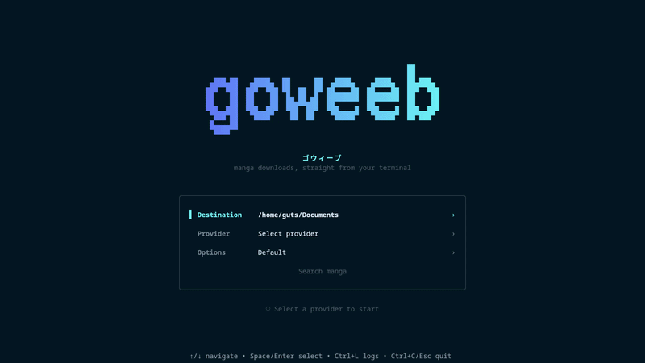

**English** | [Français](README_FR.md)

# goweeb

[](https://github.com/EliasLd/goweeb/releases/latest)
[](https://github.com/EliasLd/goweeb/actions/workflows/ci.yml)
[](https://github.com/EliasLd/goweeb/actions/workflows/container.yml)
[](https://github.com/EliasLd/goweeb)

**Download manga directly from your terminal.**

goweeb is a cross-platform manga downloader available as both an interactive **Terminal UI (TUI)** and a flexible **Command-Line Interface (CLI)**.



## Features

- Interactive TUI and script-friendly CLI.
- Multiple manga providers and languages.
- Flexible chapter selection such as `1-10`, `10-`, `-5`, or `1-10,20,30-40`.
- Integer and decimal chapter support.
- Automatic handling of unavailable chapters inside requested ranges.
- PDF output or ebook-friendly image folders.
- Automatic HTTP retries for unstable connections and temporary server failures.
- Custom provider domains and compatible mirrors.
- Native binaries for Linux, macOS and Windows.
- OCI container image for `linux/amd64` and `linux/arm64`.

## Quick start

### Native

Download the latest release for your operating system:

[**Download the latest version**](https://github.com/EliasLd/goweeb/releases/latest)

Then launch the interactive TUI:

```bash
./goweeb
```

Or use the CLI:

```bash
goweeb --source weebcentral --range 1-10 "blue lock"
```

### Container

The official image contains both the **TUI** and **CLI**:

```text
ghcr.io/eliasld/goweeb:latest
```

Pull it with Podman:

```bash
podman pull ghcr.io/eliasld/goweeb:latest
```

Create a local download directory:

```bash
mkdir -p downloads
```

Launch the TUI:

```bash
podman run --rm -it \
  --userns=keep-id:uid=1000,gid=1000 \
  -v "$(pwd)/downloads:/home/goweeb/Documents:Z" \
  ghcr.io/eliasld/goweeb:latest
```

Or use the CLI:

```bash
podman run --rm -it \
  --userns=keep-id:uid=1000,gid=1000 \
  -v "$(pwd)/downloads:/home/goweeb/Documents:Z" \
  ghcr.io/eliasld/goweeb:latest \
  cli --source weebcentral --range 1-10 "blue lock"
```

> [!IMPORTANT]
> The official container writes downloads to `/home/goweeb/Documents`.
> Mount this directory to persist downloaded files on the host.

The image is OCI-compatible and can also be used with Docker. Depending on your host platform and container runtime, bind-mount ownership options may differ.

## Supported providers

| Provider | Language | Website |
| --- | --- | --- |
| WeebCentral | English | https://weebcentral.com |
| MangaDex | Multilingual | https://mangadex.org |
| Mangavyvy | English | https://mangavyvy.com |
| MangaFreak | English | https://ww3.mangafreak.me |
| Anime-Sama | French | https://anime-sama.pw |

> [!NOTE]
> MangaDex entries hosted externally are currently ignored. goweeb only downloads chapters directly hosted by MangaDex.

> [!TIP]
> Support for additional providers can be added without changing the main download workflow.

## Installation

### Windows

1. Download the Windows archive from the [latest release](https://github.com/EliasLd/goweeb/releases/latest).
2. Extract it to a directory of your choice.
3. Open PowerShell or CMD in that directory.
4. Run the TUI or CLI executable.

### Linux / macOS

Download the archive matching your operating system (`darwin` for macOS), then make the binary executable:

```bash
chmod +x goweeb
```

Optionally move it somewhere available in your `PATH`:

```bash
sudo mv goweeb /usr/local/bin/
```

### Build from source

Clone the repository:

```bash
git clone https://github.com/EliasLd/goweeb.git
cd goweeb
```

Build the TUI:

```bash
go build -o goweeb-tui ./cmd/goweeb-tui
```

Build the CLI:

```bash
go build -o goweeb-cli ./cmd/goweeb-cli
```

## Terminal UI

The TUI is the easiest way to use goweeb interactively.

Launch it and follow the interface:

```bash
./goweeb
```

The workflow is straightforward:

1. Enter a manga title.
2. Select a provider.
3. Optionally configure a custom provider domain.
4. Configure the output options.
5. Select the correct manga when multiple results are found.
6. Select a scan version or language when applicable.
7. Choose the chapters to download.
8. Follow the download progress directly from the TUI.

When only one manga or scan version is available, goweeb selects it automatically.

## Command-Line Interface

The CLI is useful for scripting, automation, or quickly downloading known chapters.

### Basic syntax

```bash
goweeb --source <provider> [options] "manga-name"
```

`--source` is required in CLI mode.

Manga titles may be quoted or unquoted. Quotes are recommended for titles containing spaces.

When using an unquoted title, place it after all CLI options.

### Options

| Option | Shortcut | Description |
| --- | --- | --- |
| `--source <provider>` | — | Provider used to search for and download the manga. Required in CLI mode. |
| `--all` | `-a` | Download all available chapters. |
| `--range <selection>` | `-r` | Download specific chapters, ranges, or multiple ranges. |
| `--scan-dir <folder>` | `-d` | Output directory. Default: `scan` in the native CLI. |
| `--ebook-friendly` | — | Store chapter images in `Chapter XXX/` folders instead of generating PDFs. |
| `--domain <url>` | `-u` | Override the selected provider's default domain. |
| `--debug` | — | Enable verbose debug logging. |

Inside the official container, the output directory is fixed to:

```text
/home/goweeb/Documents
```

### Chapter ranges

Supported formats:

```text
10             # Chapter 10 only
1-10           # Chapters 1 through 10
10-            # Chapter 10 through the latest available chapter
-10            # Last 10 available chapters
1-10,20-30     # Multiple ranges
1,5,10         # Individual chapters
1-10,25,40-50  # Ranges and individual chapters combined
```

Decimal chapters are supported as well:

```text
6.5
1-6.5
6,6.5,7
```

Selections are matched against chapters actually available from the selected provider.

For example, if only chapters `1-50` and `70-100` exist, requesting:

```text
1-100
```

downloads the available chapters while automatically skipping `51-69`.

If neither `--all` nor `--range` is provided, goweeb asks you interactively which chapters to download.

## Examples

### Download all chapters

```bash
goweeb --source mangadex --all "one piece"
```

### Download a chapter range

```bash
goweeb --source weebcentral --range 100-120 "jujutsu kaisen"
```

### Download the latest chapters

Download the last 10 available chapters:

```bash
goweeb --source animesama --range -10 "one piece"
```

### Combine options

```bash
goweeb \
  --source weebcentral \
  --range 1-50 \
  --scan-dir scans \
  --ebook-friendly \
  "one piece"
```

### Use a custom provider domain

```bash
goweeb \
  --source animesama \
  --domain https://example.com \
  --all \
  "one piece"
```

Custom domains are useful when a provider changes domain while remaining compatible with the existing scraper.

## Ebook-friendly mode

> [!WARNING]
> Ebook-friendly mode does not generate EPUB files.

Instead of creating one PDF per chapter, goweeb saves manga pages into separate chapter directories:

```text
One Piece/
├── Chapter 001/
│   ├── 001.jpg
│   ├── 002.jpg
│   └── ...
├── Chapter 002/
│   ├── 001.jpg
│   └── ...
└── ...
```

Example:

```bash
goweeb \
  --source weebcentral \
  --all \
  --ebook-friendly \
  "one piece"
```

This structure can then be processed by tools such as [Kindle Comic Converter](https://github.com/ciromattia/kcc) for Kindle, Kobo and other e-readers.

## Contributing

Contributions are very welcome.

goweeb's provider architecture is designed to make adding support for new manga websites relatively isolated from the rest of the application.

Contributions can include:

- New providers.
- Fixes for existing providers.
- TUI or CLI improvements.
- Tests and reliability improvements.
- Documentation.
- Bug reports and feature suggestions.

See [**CONTRIBUTING.md**](CONTRIBUTING.md) for development guidelines and instructions for adding a provider.

## Support the project

If goweeb is useful to you, consider leaving a ⭐ on the repository.

It helps the project become easier to discover and is always appreciated.

<a href="https://www.star-history.com/?repos=EliasLd%2Fgoweeb&type=date&legend=top-left">
  <picture>
    <source
      media="(prefers-color-scheme: dark)"
      srcset="https://api.star-history.com/chart?repos=EliasLd/goweeb&type=date&theme=dark&legend=top-left"
    />
    <source
      media="(prefers-color-scheme: light)"
      srcset="https://api.star-history.com/chart?repos=EliasLd/goweeb&type=date&legend=top-left"
    />
    
  </picture>
</a>

## ⚠️ Disclaimer

goweeb is intended for personal use and educational purposes.

Whenever possible, please support manga authors and publishers by purchasing official releases or using legal distribution platforms.
