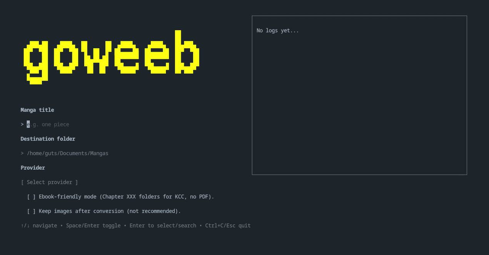

**Français** | [English](README.md)

# goweeb



**goweeb** est un outil rapide permettant de télécharger des scans de mangas depuis plusieurs sites et dans différentes langues.

Il est disponible à la fois sous forme d'interface interactive dans le terminal (TUI) et d'outil en ligne de commande (CLI).

Actuellement, il est possible de télécharger des manga depuis les sites suivants:

| Provider   | Site                      |
| ---------- | ------------------------- |
| Weebcentral (Anglais) | https://weebcentral.com |
| Mangadex (Plurilingue) | https://mangadex.org |
| MangaVyvy (Anglais) | https://mangavyvy.com |
| MangaFreak  (Anglais) | https://ww3.mangafreak.me |
| Anime-Sama (Français uniquement) | https://anime-sama.pw |

> [!NOTE]
> Pour **Mangadex**, seuls les manga directement hebergés sur *mangadex.org* sont disponibles au téléchargement.
> Les manga hebergés sur des liens externes ne sont pour le moment pas gérés puisqu'ils nécessitent l'implémentation d'un scraper dédié (WIP).

> [!TIP]
> De nouveaux sites seront pris en charge au fil du temps.

## Installation

L'installation est simple. Rendez-vous dans la section **Releases** du dépôt GitHub et téléchargez la [dernière version](https://github.com/EliasLd/goweeb/releases/latest) de l'outil correspondant à votre système d'exploitation.

### Windows

1. Téléchargez l'archive Windows.
2. Extrayez-la dans le dossier de votre choix.
3. Ouvrez un terminal (PowerShell ou CMD) dans ce dossier et lancez l'outil.

### Linux / macOS

1. Téléchargez l'archive correspondant à votre système d'exploitation (`darwin` pour macOS).
2. Rendez le binaire exécutable :

```bash
chmod +x goweeb
```

3. Vous pouvez également le déplacer dans `/usr/local/bin` afin de pouvoir l'utiliser depuis n'importe où :

```bash
sudo mv goweeb /usr/local/bin/
```

## Utilisation

goweeb est disponible en deux versions.

### Interface graphique (TUI) - Recommandée pour les débutants

Lancez simplement l'exécutable TUI :

```bash
# Linux / macOS
./goweeb

# Windows
goweeb.exe
```

Laissez ensuite l'interface interactive vous guider.

* Saisissez le titre du manga que vous recherchez.
* Sélectionnez le provider que vous souhaitez utiliser.
* Configurez éventuellement un domaine personnalisé pour le provider sélectionné.
* Configurez vos options de téléchargement.
* Choisissez le manga parmi les résultats si plusieurs correspondances sont trouvées.
* Sélectionnez une version du scan si plusieurs sont disponibles.
* Choisissez les chapitres que vous souhaitez télécharger.
* Lancez le téléchargement et suivez sa progression en temps réel.

### Ligne de commande (CLI) - Pour les utilisateurs avancés

### Format du nom du manga

Le nom du manga doit être saisi **entre guillemets**, en particulier lorsqu'il contient des espaces.

Vous pouvez utiliser n'importe quel terme de recherche pris en charge par le provider sélectionné, par exemple un titre en français, en anglais ou en japonais.

Exemples :

```text
"one piece"
"jujutsu kaisen"
"chainsaw man"
"attaque des titans"
```

Si plusieurs résultats correspondent à votre recherche, goweeb vous proposera de sélectionner le bon manga dans une liste interactive.

### Syntaxe de base

```bash
goweeb --source <provider> [options] "nom-du-manga"
```

L'option `--source` est obligatoire lors de l'utilisation du CLI.

### Options disponibles

| Option                 | Raccourci | Description                                                                                                                                                                                                     |
| ---------------------- | --------- | --------------------------------------------------------------------------------------------------------------------------------------------------------------------------------------------------------------- |
| `--source <provider>`  | aucun     | Sélectionne le provider utilisé pour rechercher et télécharger le manga. Cette option est obligatoire en mode CLI.                                                                                              |
| `--all`                | `-a`      | Télécharge tous les chapitres disponibles.                                                                                                                                                                      |
| `--range <plage>`      | `-r`      | Télécharge directement un chapitre ou une plage précise sans utiliser la sélection interactive. Optionnel, principalement utile si vous savez déjà quels chapitres vous souhaitez télécharger.                  |
| `--scan-dir <dossier>` | `-d`      | Dossier dans lequel les fichiers téléchargés seront sauvegardés. Par défaut : `pdf`.                                                                                                                            |
| `--ebook-friendly`     | aucun     | Sauvegarde les chapitres sous forme d'images dans des dossiers séparés comme `Chapter 001/`, `Chapter 002/`, etc. Compatible avec des outils comme [Kindle Comic Converter](https://github.com/ciromattia/kcc). |
| `--domain <url>`       | `-u`      | Remplace le domaine par défaut du provider sélectionné.                                                                                                                                                         |
| `--debug`              | aucun     | Active les logs de debug détaillés. CLI uniquement.                                                                                                                                                             |
| `--keep-images`        | `-k`      | Conserve les images téléchargées après la création du PDF.                                                                                                                                                      |

Formats pris en charge par `--range` :

```text
10       # Chapitre 10 uniquement
1-10     # Chapitres 1 à 10
10-      # Du chapitre 10 jusqu'au dernier chapitre disponible
-10      # Les 10 derniers chapitres
```

Si ni `--all` ni `--range` ne sont spécifiés, goweeb vous demandera de choisir interactivement les chapitres à télécharger.

## Exemples d'utilisation

### Télécharger tous les chapitres d'un manga

Avec Anime-Sama :

```bash
goweeb --source animesama --all "one piece"
```

Avec MangaFreak :

```bash
goweeb --source mangafreak --all "jujutsu kaisen"
```

### Télécharger un chapitre précis

```bash
goweeb --source mangafreak --range 100 "jujutsu kaisen"
```

### Télécharger une plage de chapitres

```bash
goweeb --source mangafreak --range 100-120 "jujutsu kaisen"
```

Vous pouvez également utiliser le raccourci :

```bash
goweeb --source mangafreak -r 100-120 "jujutsu kaisen"
```

Si vous ne spécifiez pas `--range`, goweeb vous demandera quels chapitres télécharger après la sélection du manga.

### Télécharger les derniers chapitres

Télécharger les 10 derniers chapitres :

```bash
goweeb --source animesama --range -10 "one piece"
```

Télécharger tous les chapitres à partir du chapitre 100 :

```bash
goweeb --source mangafreak --range 100- "jujutsu kaisen"
```

### Spécifier un dossier de destination

```bash
# Les fichiers seront sauvegardés dans le dossier "mes-mangas"
goweeb --source animesama -d mes-mangas --all "naruto"
```

Ou avec un chemin complet :

```bash
goweeb --source mangafreak --scan-dir ~/Documents/Mangas "one piece"
```

Sous Windows :

```powershell
goweeb --source mangafreak -d "C:\Users\<votre-utilisateur>\Documents\Mangas" "one piece"
```

### Spécifier un domaine personnalisé

L'option `--domain` peut être utile lorsqu'un provider change de domaine ou lorsque vous souhaitez utiliser un miroir compatible.

```bash
goweeb --source animesama \
  --domain https://example.com \
  --all \
  "one piece"
```

Ou avec le raccourci :

```bash
goweeb --source animesama \
  -u https://example.com \
  --all \
  "one piece"
```

### Télécharger avec une structure adaptée aux liseuses

> [!WARNING]
> Le mode ebook-friendly ne génère pas de fichiers EPUB.
>
> Il télécharge les pages du manga dans une structure de dossiers pouvant ensuite être utilisée par des logiciels tiers conçus pour les liseuses.

Ce mode fonctionne par exemple très bien avec [Kindle Comic Converter](https://github.com/ciromattia/kcc), qui permet de convertir les chapitres téléchargés pour Kindle, Kobo et d'autres liseuses.

```bash
goweeb --source mangafreak \
  --all \
  --ebook-friendly \
  "one piece"
```

La structure générée ressemble à ceci :

```text
One Piece/
├── Chapter 001/
│   ├── 001.jpg
│   ├── 002.jpg
│   └── ...
├── Chapter 002/
│   ├── 001.jpg
│   └── ...
└── ...
```

### Combiner plusieurs options

```bash
goweeb \
  --source mangafreak \
  --range 1-50 \
  --scan-dir scans \
  --ebook-friendly \
  "one piece"
```

Exemple sous Windows :

```powershell
goweeb \
  --source animesama \
  -d "C:\Users\<votre-utilisateur>\scans" \
  -r 1-50 \
  "one piece"
```

## Conseils

> [!TIP]
>
> * Le fonctionnement de la recherche dépend du provider sélectionné.
> * Certains providers peuvent proposer plusieurs versions d'un même manga, par exemple en couleur ou en noir et blanc.
> * Lorsqu'un seul manga ou une seule version est disponible, goweeb la sélectionne automatiquement.
> * Utilisez `--range` si vous savez déjà exactement quels chapitres vous souhaitez télécharger.
> * Si vous ne savez pas quels chapitres sont disponibles, omettez `--range` et utilisez la sélection interactive.
> * Utilisez `--debug` lorsque vous développez ou dépannez un provider.
> * Si un provider pris en charge change de domaine mais reste compatible avec le scraper existant, vous pouvez remplacer son URL par défaut grâce à l'option `--domain` / `-u` ou au champ de domaine personnalisé disponible dans le TUI.

## Contribution

Les contributions sont les bienvenues.

L'un des objectifs principaux de l'architecture de goweeb est de faciliter l'ajout de nouveaux sites de mangas sans avoir à modifier l'ensemble de l'application.

**Consultez [CONTRIBUTING_FR.md](CONTRIBUTING_FR.md) pour les instructions de contribution et le guide d'ajout d'un nouveau provider.**

## Remerciements

Si cet outil vous plaît, n'hésitez pas à laisser une étoile ⭐. Merci !
